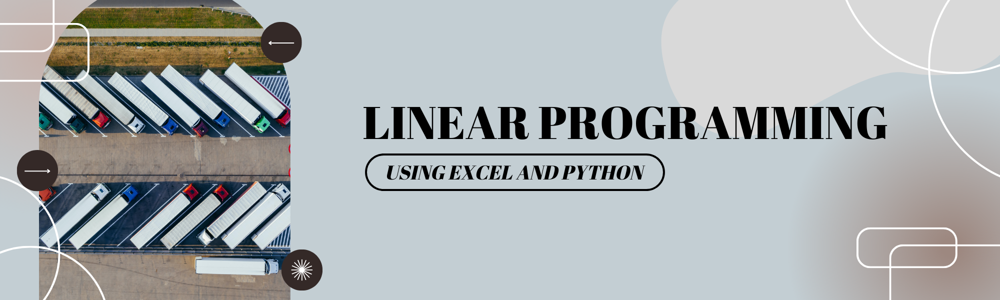

# algo-linear-programming

Author:  Erin James Wills, ejw.data@gmail.com  

  

<cite>Photo by <a href="https://unsplash.com/@marcinjozwiak?utm_source=unsplash&utm_medium=referral&utm_content=creditCopyText">Marcin Jozwiak</a> on <a href="https://unsplash.com/s/photos/logistics?utm_source=unsplash&utm_medium=referral&utm_content=creditCopyText">Unsplash</a></cite>

 

## Overview  
Linear programming examples

  

### Technologies
* Excel
* Python Pulp
### Improvements
* add visualization of Excel answer
