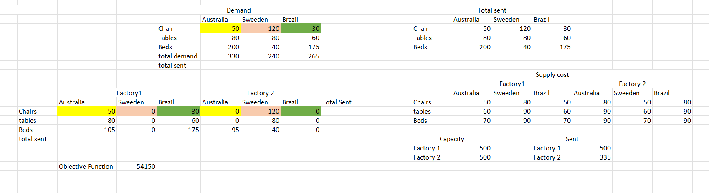
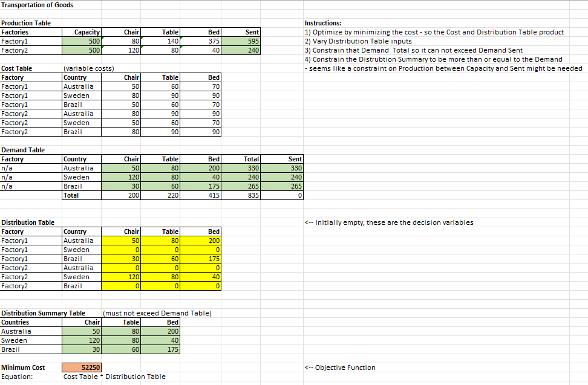
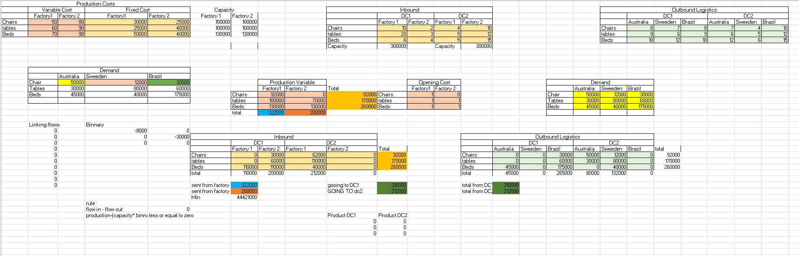
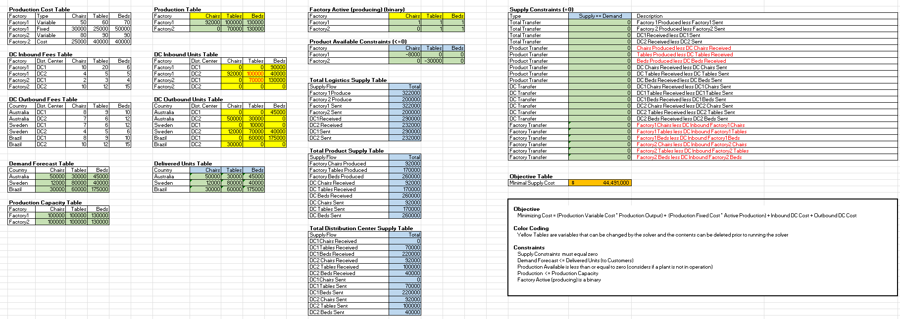

# linear-programming-production-scheduling

Author:  Erin James Wills, ejw.data@gmail.com  

  

<cite>Photo by <a href="https://unsplash.com/@marcinjozwiak?utm_source=unsplash&utm_medium=referral&utm_content=creditCopyText">Marcin Jozwiak</a> on <a href="https://unsplash.com/s/photos/logistics?utm_source=unsplash&utm_medium=referral&utm_content=creditCopyText">Unsplash</a></cite>

 

## Overview  
This repo contains linear programming examples of production scheduling and distribution using Excel and Python.  These activities are largely from a Udemy course on `Data Science and Supply Chain Analytics with Python`.  Part of my interest in doing these activities was to improve the content of the course - many of the examples were not well structured and even had errors.   To make the examples provided more error resistent, I converted the examples to Python using PuLP.    

These particular topics interest me since it is very similar to chemical production problems where raw materials must be allocated to production facilities based on the demand, product margin, and storage and distribution limits.  The level of complexity that can be accounted for in these problems is quite amazing expecially when blending solutions for forecasting, linear optimization, and discrete event simulations.   I might add a combination of those technologies into a solution in the next update.  

## Examples  
Below is an example of a class activity of a basic production scheduling problem.  The activity was not very well organized so I modified it to be more understandable.  
  

Here is what the modified version looks like.  The inputs are color coded and constraints clearly labeled.  
  

A screen shot of the advanced homework solution is below but upon reviewing the image, it is obvious the constraints were not appropriately set.    
   
Below is the modified version that has contraints that meet the problem statement and is organized to more clearly see the relationships among the tables.  
  

Although Excel Solver is a popular tool for these type of linear programming problems, much of the setup requires not making any mistakes in setting up the relationships in the spreadsheet and the relationships are hidden witin the cell equations.  I moved the problems to Python and using PuLP to create a much more readable and understandable model.  In addition, I am modifying the code to use pandas dataframes as the source data so additional data exploration can be easily accomplished during analysis.  

Additional features will be added but as of the latest revision, about 85% of the expanded content has been completed and all the fundamental content is complete.  

## Repo Contents  

### Excel Simulations  
1.  `constrained-linear-equations.xlsx` - Selecting product quantity to produce maximize profits and keeping with raw material inventory.
1.  `transportation-goods.xlsx` - Selecting factory production and shipments of each product to each country while minimizing cost, meeting demand, and not exceeding factory capacity.  
1.  `adv-transportation-goods.xlsx` - Selecting factory production, distribution center, and shipments of each product to each country while minimizing cost, meeting demand, and not exceeding factory capacity.  
1.  `production-scheduling.xlsx` - Determining production and inventory amounts based on minimizing operational expenses while operating within production capacity and at least meeting demand.

 

### Python Simulations  
1.  `linear-optimization.ipynb` - Python PuLP library version of the Excel `constrained-linear-equations.xlsx`
1.  `linear-optimization-shipping.ipynb` - Python PuLP library version of the Excel `transportation-goods.xlsx`
1.  `linear-optimization-shipping-pandas.ipynb` - modified version of `linear-optimization-shipping.ipynb` that utilizes pandas dataframes to access data instead of generating lists.
1.  `linear-optimization-adv-shipping-pandas.ipynb` - work in progress  
1.  `production-scheduling.ipynb` - Python PuLP library version of Excel `production-scheduling.xlsx`
1.  `production-scheduling-sensitivity.ipynb` - modified version of `production-scheduling.ipynb` that allows for a list of any any user supplied variable to be substituted.  The outcomes are plotted on to allow easy analysis of the effects of variable changes.  
  

### Technologies
* Excel
* Python PuLP
### Improvements
* add visualization of Excel and Python answers
